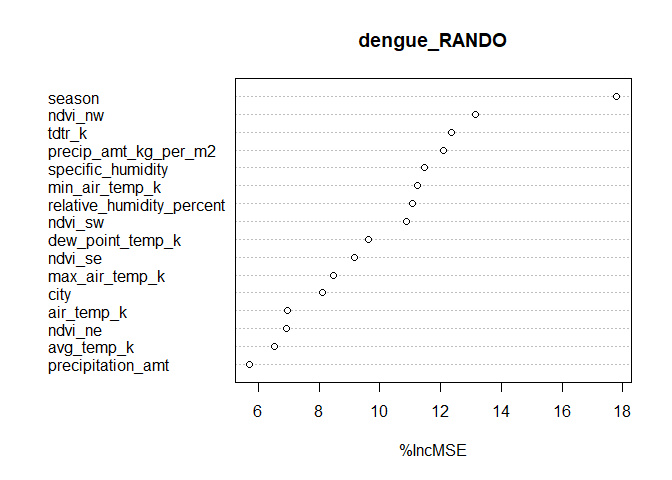
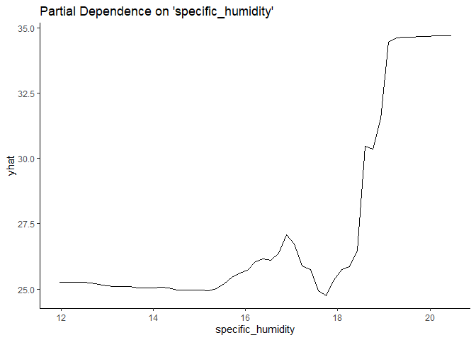
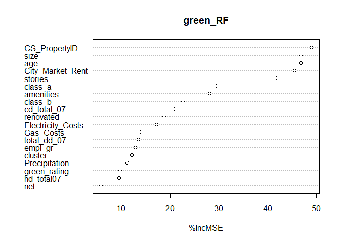
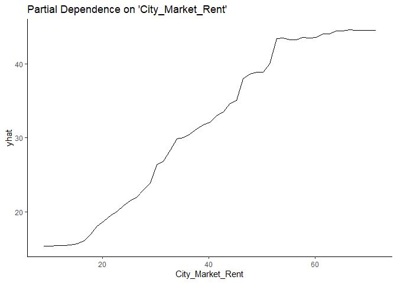
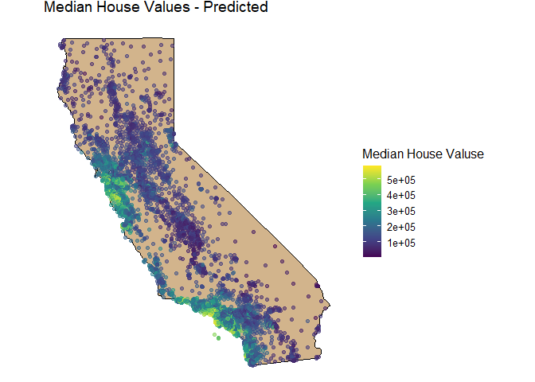

What Causes What?
-----------------

### 1.) Why can’t I just get data from a few different cities and run the regression of “Crime” on “Police” to understand how more cops in the streets affect crime? (“Crime” refers to some measure of crime rate and “Police” measures the number of cops in a city.)

In a vast majority of situations, establishing causation is not as
simple as running a regression on two variables and calling it a day.
Although there may be a significant relationship between a variable of
interest and a particular covariate, it is common that there is much
more explaining the change in a target variable’s value. In the case of
regressing “Police” against “Crime”, a particular city’s crime rate
could be affected by many other factors such as population density or
public education spending. When adding covariates such as these to a
regression, we could see that variations in crime are less explained by
policing and more so by other factors. With this in mind, researchers
have developed methods to extract causality from their models, helping
us see the true effect of “Police” on “Crime.”

### 2.) How were the researchers from UPenn able to isolate this effect? Briefly describe their approach and discuss their result in the “Table 2” below, from the researchers’ paper.

Researchers from UPenn used an interesting method to extrapolate the
true effect of police presence on crime rate in Washington D.C. Fairly
unique to the nation’s capital is the utilization of terror alert
levels, which are designed to establish a greater police presence in the
city to thwart varying threats of terrorism. The researchers took
advantage of this unique situation to find the causal effect of “Police”
on “Crime.” In one regression, they observed that, on “High-Alert” days,
higher police presence was associated with lower crime rates. In
another, the researchers controlled for METRO ridership, and still noted
a significant negative relationship between “High-Alert” and “Crime.”
This was paired with a positive relationship between “Crime” and METRO
useage, as was expected. These regressions showed a clear ‘before and
after’ effect on the variable of interest.

### 3.) Why did they have to control for Metro ridership? What was that trying to capture?

While gathering this data, the researchers navigated around a potential
flaw in their research design. They called into question the effect of
alert levels on general activity within the city. If threat-levels are
high, were less people going to go about their day as they normally
would? If so, this could explain lower crime rates, deterring the
researchers from establishing a causal effect between “Police” and
“Crime.” The researchers decided to measure the usage of the city’s
METRO during varying alert levels. They saw that, even when including
ridership in their model, greater police presence (by proxy of
‘High-Alert’) still affected crime rates negatively. Moreover, ridership
was generally unaffected by the alert levels. Ultimately, the
researchers argued there was a theoretically sound reason to measure
METRO ridership and controlled for it in their model.

### 4.) Below I am showing you “Table 4” from the researchers’ paper. Just focus on the first column of the table. Can you describe the model being estimated here? What is the conclusion?

This table shows how crime rates were affected during ‘High Alert’
status in different areas of the city. This was achieved by interacting
the ‘High Alert’ variable with the differing areas. We can see that
crime rates were reduced by a sizable magnitude in ‘District 1’ while
all other districts did not see a statistically significant decline in
crime rates. Furthermore, there was still a statistically significant
increase in crime when increasing midday ridership. These relationships
may show that police presence increases mostly in District 1 when the
city is under high alert. Conversely, if police presence is being
increased uniformly across districts, there could be something else
explaining the decrease in crime in District 1 while under high alert.

Tree Modeling: Dengue Cases
---------------------------

In this analysis, we will look at which model preforms best when
predicting dengue cases. The models of interest are CART, random forest,
and gradient-boosted trees. In this order, we will calculate each of
their out-of-sample performance then take the best model to make some
partial dependence plots. Let’s get going!

### Building our models:

#### CART

We will build this model using R’s rpart() function, regressing
total\_cases against all other variables. Initially, we will build a
very complex tree, using a high complexity parameter for our splits. We
will then prune our tree to find the optimal complexity parameter.

Below shows a plot of our cross validated error for increasing levels of
our complexity parameter. We can see that it bottoms out very quickly,
so a model with the parameter that minimizes this error will still be
quite simple. This is opposed to choosing the simplest model within one
standard error of the minimum, which we would do if our error was
minimized with a very complex model. In this case, doing this would
likely lead to a model that was too simple, leading our model to not
split at all. Here, it seems we can afford to choose the parameter that
minimizes cross-validated error.

Our tree model, depending on training and testing splits, will
typically, at the very least, split on the variable min\_air\_temp\_k:

Now that we have our model using CART, let us move on to the next!

#### Random Forests

Next on our list is our Random Forests model. Like the CART model, we
will run total\_cases against all covariates in the model. We will
impute NA values in our data set for ease of use.

Important to note, due to the nature of random forests, particularly in
the repeated random sampling of the data set, cross-validation is not
required as it was for the CART model.

Below shows our variable importance from running this model:

Unsurprisingly, min\_air\_temp\_k and season are among the most import
variables in this model, consistent with our CART model.

#### Gradient Boosted Trees

Finally we will build a model using Gradient Boosted Trees. To build the
best model we can, we will first plot the cross validated error to find
the optimal iteration of trees to use.

    ## [1] 164

Above, the green line represents our cross validated error and the
number displayed is the number of iterations minimizing this. We will
optimize our model according to this iteration of trees used.

### Out-of-sample RMSEs

Alright, the moment we’ve been waiting for. We have built our models,
now let’s see our out-of-sample performance for each using the testing
data we set aside earlier.

*CART:*

    ## [1] 43.1272

*Random Forests:*

    ## [1] 24.01906

*Gradient Boosted Trees:*

    ## [1] 32.16595

We can clearly see that our Random Forests model outperforms the other
two. Now that we have our best-performing model, we can create some
partial dependency plots for key variables of interest:

We can see from our plots that as these variables increase, so does
their impact on the predicted number of cases. This is likely because
increases in these factors are known to be associated with more
hospitable conditions for mosquitoes. With increases in these variables,
we are likely to see more mosquito proliferation, leading to more
incidences of dengue fever.

Predictive Model Building: Green Certification
----------------------------------------------

For this analysis, we will attempt to build the best model possible for
predicting revenue per square foot per calender year for commercial
rental properties in the United States. This will be done by taking the
rent charged per square foot per year and multiplying it by the
building’s occupancy rate. A key variable of interest will be ‘green
certification,’ showing us if a building is classified as ‘green’
affects its revenue.

In this process, we will be splitting our data into a training set and
testing set, building a few models using the training data, and
selecting the one that has the best out-of-sample performance using our
testing set. All cross validation will be done on our training data
before testing out-of-sample performance.

### Linear model using Lasso regression

Our first model will be constructed using the Lasso regression method.
This will give us a linear model with the most important features
selected automatically. The root mean squared error is reported below as
this models out-of-sample performance:

    ## [1] 10.78265

### Random Forests

Our next model will be built using random forests. As we can see, its
out-of-sample performance far exceeds our linear model:

    ## [1] 6.697933

### Gradient Boosted Trees

Finally, we will see how an optimized gradient boosted tree model stacks
up:

    ## [1] 9.008439

We can see from the results above that our random forests model
performed the best. We will use this model for the rest of our analysis
by finding variables of import and making some partial dependence plots.

### Variaable Importance Plot:

The plot above reveals some interesting information on what is affecting
revenues for these properties. Perhaps unsurprisingly, size, age, and
Cit\_Market\_Rent (average rent per square foot per calender year in the
building’s local market) seem to be some of the most significant
variables in our data set. Green\_rating falls quite short here, as it
seems to have little effect on revenues.

### Particial Dependence Plots

To help us visualize how our variable of import affect revenues, we will
display some of their partial dependence plots

We can see above that for larger properties predicted revenues are
higher with predicting plateauing at a particular point.

On the other hand, age seems to have an initial increasing relationship
with revenues then a steady decline to about 100 years old followed by
an upward spike. This may be the result of older buildings being over
100 years old being in densly populated areas causing prices and
revenues to go up.

Finally, as with size, City\_Market\_Rent has an increasing relationship
with predicted revenues. This hints that certain areas have higher
demand for commercial real estate, driving revenues upward.

### Conculsions

Ultimately, for predicting revenue per square foot per calender year,
building a model using random forests gave us the best performance. We
saw that size, age, and City\_Market\_Rent greatly affected these
revenues. Additionally, green certification had little affect on our
variable of interest.

Predictive Model Building: California housing
---------------------------------------------

Similar to our last analysis, we will again attempt to build the best
model possible in predicting median housing values in California. This
will be done by seperating our data into training and testing sets,
building and cross validating models using our training data, and
testing out-of-sample performance using root mean squared error as a
measure.

Below are the RMSEs for three different models: Lasso regression, Random
Forests, and Gradient Boosted Trees.

### Lasso

    ## [1] 68112.35

### Random Forests

    ## [1] 49829.93

### Gradient Boosted Trees

    ## [1] 47344.05

Here, our gradient boosted trees model performs the best.

#### Plotting Median House Value

Using the original data and predictions from our random forest model we
will do three projections of values onto a map of California. There will
be a plot for actual, predicted, and residual values for median housing
prices on this map.

From these plots we can see that housing values tend to be greater on
the coast and in more densely populated areas. Our predictions follow
the trends in the actual data and we can see that our greatest residuals
are in these areas as well. This is likely due to greater fluctuations
in price in densely populated areas. Ultimately, our gradient boosted
trees model seems to perform well when predicting median housing values
in California.
