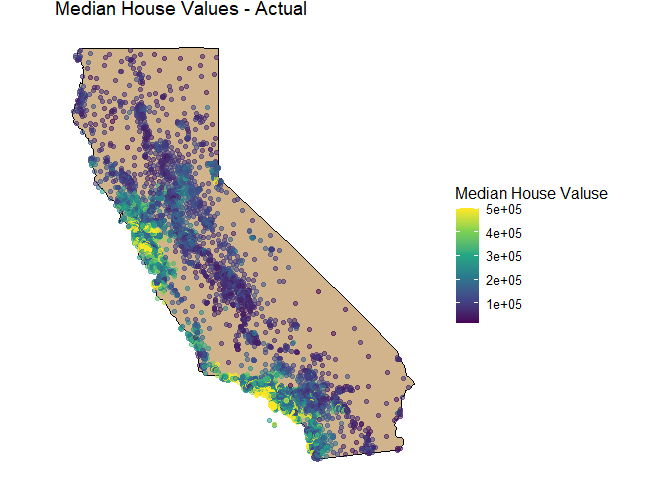

What Causes What?
-----------------

### 1.) Why can’t I just get data from a few different cities and run the regression of “Crime” on “Police” to understand how more cops in the streets affect crime? (“Crime” refers to some measure of crime rate and “Police” measures the number of cops in a city.)

In a vast majority of situations, establishing causation is not as
simple as running a regression on two variables and calling it a day.
Although there may be a significant relationship between a variable of
interest and a particular covariate, it is common that there is much
more explaining the change in a target variable’s value. In the case of
regressing “Police” against “Crime”, a particular city’s crime rate
could be affected by many other factors such as population density or
public education spending. When adding covariates such as these to a
regression, we could see that variations in crime are less explained by
policing and more so by other factors. With this in mind, researchers
have developed methods to extract causality from their models, helping
us see the true effect of “Police” on “Crime.”

### 2.) How were the researchers from UPenn able to isolate this effect? Briefly describe their approach and discuss their result in the “Table 2” below, from the researchers’ paper.

Researchers from UPenn used an interesting method to extrapolate the
true effect of police presence on crime rate in Washington D.C. Fairly
unique to our nation’s capital is the utilization of terror alert
levels, which are designed to establish a greater police presence in the
city to thwart varying threats of terrorism. The researchers took
advantage of this unique situation to find the causal effect of “Police”
on “Crime.” In one regression, they observed that, on “High-Alert” days,
higher police presence was associated with lower crime rates. In
another, the researchers controlled for METRO ridership, and also noted
a negative relationship between “Police” and “Crime.” These regressions
showed a clear ‘before and after’ effect on the variables of interest.

### 3.) Why did they have to control for Metro ridership? What was that trying to capture?

While gathering this data, the researchers navigated around a potential
flaw in their research design. They called into question the effect of
alert levels on general activity within the city. If threat-levels are
high, were less people going to go about their day as they normally
would? If so, this could explain lower crime rates, deterring the
researchers from establishing a causal effect between “Police” and
“Crime.” The researchers decided to measure the usage of the city’s
METRO during varying alert levels. They saw that, even when including
ridership in their model, police presence was still associated with a
significant negative affect on crime rates. Moreover, ridership was
generally unaffected by the alert levels. Ultimately, the researchers
argued there was a theoretically sound reason to measure METRO ridership
and controlled for it in their model.

### 4.) Below I am showing you “Table 4” from the researchers’ paper. Just focus on the first column of the table. Can you describe the model being estimated here? What is the conclusion?

Tree Modeling: Dengue Cases
---------------------------

In this analysis, we will look at which model preforms best when
predicting dengue cases. The models of interest are CART, random forest,
and gradient-boosted trees. In this order, we will calculate each of
their out-of-sample performance then take the best model to make some
partial dependence plots. Let’s get going!

### Building our models:

#### CART

We will build this model using R’s rpart() function, regressing
total\_cases against all other variables. Initially, we will build a
very complex tree, using a high complexity parameter for our splits. We
will then prune our tree to find the optimal complexity parameter.

Below shows a plot of our cross validated error for increasing levels of
our complexity parameter. We can see that it bottoms out very quickly,
so a model with the parameter that minimizes this error will still be
quite simple. This is opposed to choosing the simplest model within one
standard error of the minimum, which we would do if our error was
minimized with a very complex model. In this case, doing this would
likely lead to a model that was too simple, leading our model to not
split at all. Here, it seems we can afford to choose the parameter that
minimizes cross-validated error.

    # building the model:

    dengue_CART = rpart(total_cases ~ ., data = dengue_train, control = rpart.control(cp = .000001))

    plotcp(dengue_CART)

    prune_1se = function(my_tree) {
      out = as.data.frame(my_tree$cptable)
      thresh = min(out$xerror)
      cp_opt = out$CP[out$xerror == thresh]
      prune(my_tree, cp=cp_opt)
    }

    dengue_CART = prune_1se(dengue_CART)

Our tree model, depending on training and testing splits, will
typically, at the very least, split on the variable min\_air\_temp\_k:

Now that we have our model using CART, let us move on to the next!

#### Random Forests

Next on our list is our Random Forests model. Like the CART model, we
will run total\_cases against all covariates in the model. We will omit
NA values from our data set for ease of use.

Important to note, due to the nature of random forests, particularly in
the repeated random sampling of the data set, cross-validation is not
required as it was for the CART model.

Below shows our variable importance from running this model:

Unsurprisingly, min\_air\_temp\_k and season are among the most import
variables in this model, consistent with our CART model.

#### Gradient Boosted Trees

Finally we will build a model using Gradient Boosted Trees. To build the
best model we can, we will first plot the cross validated error to find
the optimal iteration of trees to use.

    ## [1] 341

Above, the green line represents our cross validated error. We will
optimize our model according to the iteration that minimizes this.

### Out-of-sample RMSEs

Alright, the moment we’ve been waiting for. We have built our models,
now let’s see our out-of-sample performance for each.

*CART:*

    ## [1] 46.00265

*Random Forests:*

    ## [1] 28.59445

*Gradient Boosted Trees:*

    ## [1] 36.57947

We can clearly see that our Random Forests model outperforms the other
two. Now that we have our best-performing model, we can create some
partial dependency plots for key variables of interest:

*specific\_humidity:*

*precipitation\_amt:*

*min\_air\_temp\_k:*

We can see from our plots that as these variables increase, so does
their impact on the predicted number of cases. This is likely because
increases in these factors are known to be associated with more
hospitable conditions for mosquitoes. With increases in these variables,
we are likely to see more mosquito proliferation, leading to more
incidences of dengue fever.

Predictive Model Building: Green Certification
----------------------------------------------

### Linear model using Lasso regression

### Random Forests

### Gradient Boosted Trees

### RMSEs

*Lasso*

    ## [1] 9.481896

*Random Forests*

    ## [1] 6.818468

*Gradient Boosted Forests*

    ## [1] 8.631628

### Particial Dependence Plots

*size* 

*age* 

*cert* 

Predictive Model Building: California housing
---------------------------------------------

### Lasso

    ## [1] 68411.05

### Random Forests

    ## [1] 51502.59

\#Gradient Boosted Trees

    ## [1] 52015.12

#### Plotting Median House Value with Original Data

#### Plotting PREDICTED Median Housing Value

#### Plotting SQUARED RESIDUALS

